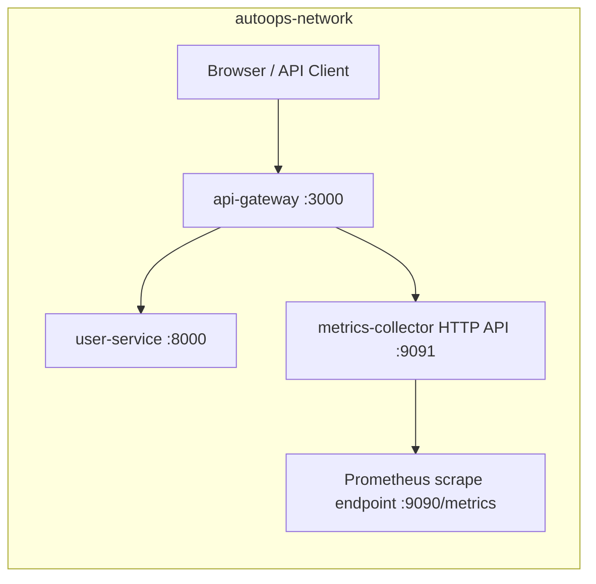

# AutoOps Platform 🚀

## Phase 1: Containerized Microservices Foundation

## Project Overview

AutoOps Platform is an enterprise-grade, AI-assisted self-healing CI/CD platform portfolio project. Phase 1 demonstrates a production-shaped local foundation: three microservices, Docker Compose orchestration, health checks, JSON logs, non-root containers, environment-based configuration, and automation scripts.

## Architecture Diagram



## Services

| Service | Language | Port | Purpose |
| --- | --- | --- | --- |
| api-gateway | Node.js + Express | 3000 | Single entry point, security middleware, health aggregation, request proxy |
| user-service | Python + FastAPI | 8000 | In-memory user CRUD service |
| metrics-collector | Go | 9091, 9090 | JSON metrics summary and Prometheus exposition |

## Prerequisites

- Docker 24+
- Docker Compose v2
- 4GB RAM available for Docker
- Bash, curl, and optionally jq

## Quick Start

```bash
cd autoops-platform
cp .env.example .env
./scripts/start.sh
```

## API Reference

| Service | Method | Endpoint | Description |
| --- | --- | --- | --- |
| api-gateway | GET | `/health` | Gateway health plus dependency reachability |
| api-gateway | ANY | `/api/users` | Proxy to user-service users collection |
| api-gateway | ANY | `/api/users/{id}` | Proxy to user-service user item |
| api-gateway | GET | `/api/metrics` | Proxy to metrics summary |
| user-service | GET | `/health` | User service health |
| user-service | GET | `/users` | List users |
| user-service | POST | `/users` | Create user |
| user-service | GET | `/users/{id}` | Get user by ID |
| user-service | PUT | `/users/{id}` | Update user |
| user-service | DELETE | `/users/{id}` | Delete user |
| metrics-collector | GET | `/health` | Metrics collector health |
| metrics-collector | GET | `/api/metrics` | JSON metrics summary |
| metrics-collector | GET | `/metrics` | Prometheus text exposition |

## Health Checks

```bash
./scripts/health-check.sh
curl -s http://localhost:3000/health | jq .
curl -s http://localhost:8000/health | jq .
curl -s http://localhost:9091/health | jq .
curl -s http://localhost:9090/metrics | grep autoops_
```

## Development Mode

Docker Compose automatically reads `docker-compose.override.yml`. The override mounts local source code, runs the gateway with `nodemon`, and runs the user service with Uvicorn reload.

```bash
docker compose -f docker-compose.yml -f docker-compose.override.yml up --build
```

## Environment Variables

| Variable | Default | Used By | Description |
| --- | --- | --- | --- |
| PORT | 3000 | api-gateway | Gateway HTTP port |
| NODE_ENV | production | api-gateway | Node runtime environment |
| LOG_LEVEL | info / INFO | all services | Logging verbosity |
| USER_SERVICE_URL | http://user-service:8000 | api-gateway | Internal user-service URL |
| METRICS_SERVICE_URL | http://metrics-collector:9091 | api-gateway | Internal metrics API URL |
| SERVICE_NAME | service-specific | user-service, metrics-collector | Service identity in logs and health |
| SERVICE_VERSION | 1.0.0 | user-service | User service version |
| USER_SERVICE_PORT | 8000 | documentation | External user-service port |
| MAX_USERS | 1000 | user-service | Future user capacity guard |
| VERSION | 1.0.0 | metrics-collector | Metrics collector version |
| HTTP_PORT | 9091 | metrics-collector | Metrics HTTP API port |
| METRICS_PORT | 9090 | metrics-collector | Prometheus endpoint port |
| SCRAPE_INTERVAL_SECONDS | 15 | metrics-collector | Future scrape interval |

## Project Structure

```text
autoops-platform/
├── README.md
├── .gitignore
├── .env.example
├── docker-compose.yml
├── docker-compose.override.yml
├── scripts/
│   ├── start.sh
│   ├── stop.sh
│   ├── health-check.sh
│   └── logs.sh
├── services/
│   ├── api-gateway/
│   ├── user-service/
│   └── metrics-collector/
├── docs/
│   ├── architecture.md
│   └── local-development.md
└── monitoring/
    └── placeholder.md
```

## Production Features

- Multi-stage Docker builds
- Non-root runtime users
- Container and application health checks
- Graceful shutdown handlers
- Gateway rate limiting
- Structured JSON logging
- Security headers through Helmet
- Shared Docker bridge network
- Environment-based configuration

## Phase Roadmap

| Phase | Status | Focus |
| --- | --- | --- |
| 1 | Current | Containerized microservices foundation |
| 2 | Planned | CI pipeline, tests, linting, image publishing |
| 3 | Planned | Prometheus, Grafana, alerting, SLO dashboards |
| 4 | Planned | AI-assisted incident diagnosis and self-healing workflows |
| 5 | Planned | Cloud deployment, security hardening, portfolio polish |

## Contributing / Git Workflow

- Branch naming: `phase/<number>-short-description`
- Commit format: Conventional Commits, for example `feat(phase1): initialize containerized services`
- Keep each PR focused on one platform capability.
- Include validation output in PR descriptions.

## Interview Talking Points

- Designed a three-service Docker Compose platform with health-gated startup.
- Used multi-stage Dockerfiles and non-root users to reduce runtime risk.
- Implemented structured JSON logs across Node.js, Python, and Go services.
- Added gateway-level production middleware: Helmet, CORS, rate limits, and graceful shutdown.
- Exposed Prometheus-format custom metrics for future observability phases.

## Git Commit Instructions

```bash
git init
git checkout -b phase/1-containerized-microservices
git add .
git commit -m "feat(phase1): initialize AutoOps Platform containerized microservices

- Add multi-stage Dockerfiles for api-gateway (Node.js), user-service (Python), metrics-collector (Go)
- Configure Docker Compose with health checks and shared network
- Implement structured JSON logging across all services
- Add production security: non-root users, helmet, rate limiting
- Add Prometheus metrics exposition in metrics-collector
- Add shell automation scripts: start, stop, health-check, logs
- Add comprehensive README with architecture diagram and API reference

Services: api-gateway:3000, user-service:8000, metrics-collector:9091
Phase: 1/5 - Foundation"

git remote add origin https://github.com/YOUR_USERNAME/autoops-platform.git
git push -u origin phase/1-containerized-microservices
```

## Expected Startup Output

Each line confirms a readiness step: Docker is installed, Compose is available, environment defaults exist, images build, containers start, health polling succeeds, URLs are printed, and the full health script passes.

```text
╔═══════════════════════════════════════════╗
║      AutoOps Platform - Phase 1          ║
║   Containerized Microservices Stack      ║
╚═══════════════════════════════════════════╝

[✓] Docker 24.0.7 found
[✓] Docker Compose v2.23.0 found
[✓] .env file found
[→] Building Docker images...
[→] Starting containers...
[✓] autoops-metrics-collector is healthy (8s)
[✓] autoops-user-service is healthy (12s)
[✓] autoops-api-gateway is healthy (18s)

┌─────────────────────────────────────────────┐
│           AutoOps Platform URLs             │
├──────────────────────┬──────────────────────┤
│ API Gateway          │ http://localhost:3000 │
│ User Service         │ http://localhost:8000 │
│ Metrics Collector    │ http://localhost:9091 │
│ Prometheus Metrics   │ http://localhost:9090 │
└──────────────────────┴──────────────────────┘

[✓] All services healthy. AutoOps Platform is ready.
```
