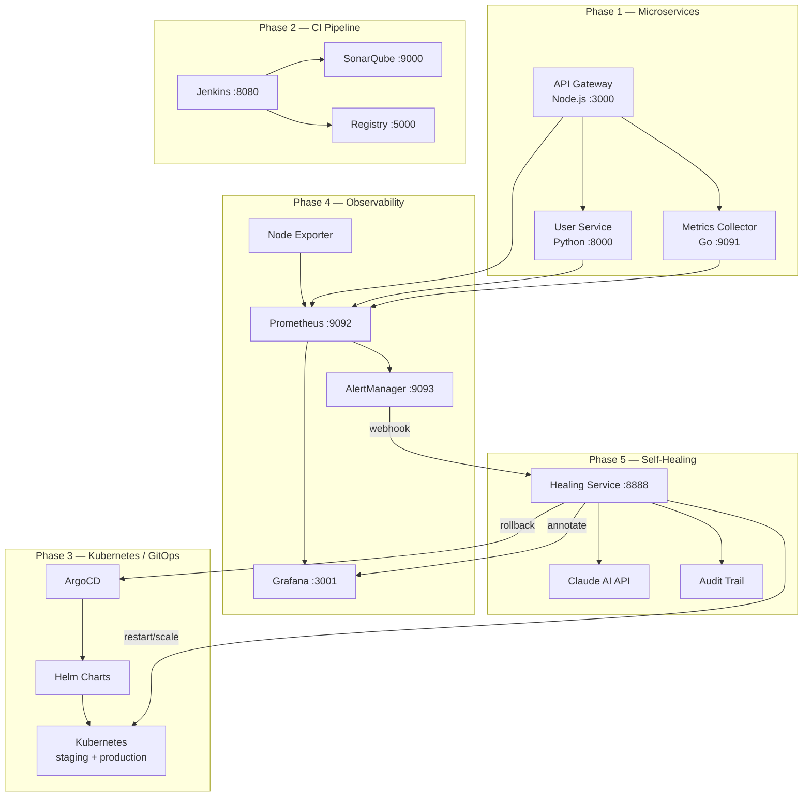

# 🚀 AutoOps Platform

## AI-Assisted Self-Healing CI/CD Platform

> An enterprise-grade DevOps platform that automatically detects, analyzes, and heals production incidents using AI-powered decision making.


---

## What is AutoOps Platform?

AutoOps is a complete DevOps platform built across 5 phases. It runs three microservices behind an API gateway, ships them through a Jenkins CI pipeline with quality gates and security scanning, deploys to Kubernetes via ArgoCD GitOps, monitors everything with Prometheus and Grafana, and — the crown jewel — automatically heals production incidents using an AI-powered self-healing engine backed by OpenRouter (Claude, GPT-4o, Gemini and more).

---

## Architecture Overview



---

## Platform Capabilities

| Feature | Technology | Status |
|---------|-----------|--------|
| API Gateway with rate limiting | Express.js + Helmet | ✅ |
| User Service with CRUD | FastAPI + Pydantic v2 | ✅ |
| Metrics Collector | Go + chi router | ✅ |
| CI Pipeline (8 stages) | Jenkins + Groovy | ✅ |
| Code Quality Gate | SonarQube | ✅ |
| Container Security Scan | Trivy | ✅ |
| Private Registry | Docker Registry v2 | ✅ |
| Kubernetes Deployment | Helm 3 | ✅ |
| GitOps Continuous Delivery | ArgoCD | ✅ |
| Horizontal Pod Autoscaling | HPA | ✅ |
| Pod Disruption Budgets | PDB | ✅ |
| Network Policies | Kubernetes NetworkPolicy | ✅ |
| Metrics Collection | Prometheus + prom-client | ✅ |
| Dashboards (3) | Grafana 10 | ✅ |
| Alert Rules (7) | PromQL | ✅ |
| SLO Tracking | Recording rules | ✅ |
| AI-Powered Healing | OpenRouter (Claude / GPT-4o / Gemini) | ✅ |
| Rule-Based Fallback | Deterministic rules | ✅ |
| Healing Audit Trail | REST API + JSON | ✅ |
| Grafana Annotations | Auto on heal events | ✅ |
| Infrastructure as Code | Terraform | ✅ |
| Secrets Management | Sealed Secrets | ✅ |
| Non-root containers | UID 1001 | ✅ |

---

## Quick Start

```bash
# Clone
git clone https://github.com/niteshram123/AutoOps-Platform.git
cd AutoOps-Platform

# Configure (optional — works without API key using rule-based fallback)
cp .env.example .env
# Edit .env: set OPENROUTER_API_KEY=sk-or-your-key

## Start everything with one command

There are helper scripts to start the entire platform (core services, CI, registry, monitoring, and frontend) with a single command.

On Linux/macOS:

```bash
./start-all.sh
```

On Windows (PowerShell / CMD):

```powershell
.
start-all.bat
```

The scripts will build and start all services using Docker Compose files: `docker-compose.yml`, `ci/sonarqube/docker-compose.sonar.yml`, `ci/registry/docker-compose.registry.yml` and `monitoring/docker-compose.monitoring.yml`.

To stop all services:

```bash
./stop-all.sh
# or on Windows
stop-all.bat
```

# Boot the entire platform
./scripts/platform/bootstrap-all.sh

# Run the interactive demo
./scripts/platform/demo.sh
```

**Access points after bootstrap:**

| Service | URL | Credentials |
|---------|-----|-------------|
| API Gateway | http://localhost:3000 | — |
| User Service | http://localhost:8000/docs | — |
| Grafana | http://localhost:3001 | admin / autoops-grafana-2024 |
| Prometheus | http://localhost:9092 | — |
| AlertManager | http://localhost:9093 | — |
| Healing Service | http://localhost:8888 | — |
| Jenkins | http://localhost:8080 | admin / admin |

---

## Phase-by-Phase Build Journey

| Phase | Branch | What Was Built |
|-------|--------|---------------|
| 1 | `phase/1-microservices` | API Gateway (Node.js), User Service (Python), Metrics Collector (Go), Docker Compose, structured JSON logging |
| 2 | `phase-2-ci-pipeline` | Jenkins pipeline (8 stages), SonarQube quality gate, Trivy security scan, private Docker registry, Jenkinsfile.feature for feature branches |
| 3 | `phase/3-kubernetes-gitops` | Helm charts for all services, ArgoCD GitOps, HPA, PDB, NetworkPolicy, canary deployment manifests, RBAC |
| 4 | `phase/4-observability` | Prometheus scrape configs, 7 alert rules, SLO recording rules, 3 Grafana dashboards, AlertManager routing, prom-client instrumentation in all 3 services |
| 5 | `phase/5-self-healing-platform` | AI healing engine (Claude API), 4 healing actions, rule-based fallback, audit trail REST API, Grafana annotations, Terraform IaC, Sealed Secrets, bootstrap + demo scripts |

---

## Service Catalog

| Service | Port | Language | Purpose |
|---------|------|----------|---------|
| api-gateway | 3000 | Node.js 18 | Reverse proxy, rate limiting, auth |
| user-service | 8000 | Python 3.11 | User CRUD, in-memory store |
| metrics-collector | 9091/9090 | Go 1.21 | Metrics aggregation, health polling |
| healing-service | 8888 | Python 3.11 | AI self-healing engine |
| prometheus | 9092 | — | Metrics scraping + alerting |
| grafana | 3001 | — | Dashboards + annotations |
| alertmanager | 9093 | — | Alert routing + deduplication |
| jenkins | 8080 | — | CI pipeline |
| sonarqube | 9000 | — | Code quality analysis |
| registry | 5000 | — | Private Docker registry |

---

## Self-Healing Engine

The healing engine closes the loop between observability and remediation:

```
Alert fires → Webhook received → AI analyzes → Action executed → Verified → Annotated
     │               │                │               │              │           │
 Prometheus    202 immediately    Claude API      ArgoCD/K8s    3 checks    Grafana
 AlertManager  (non-blocking)    or fallback     rollback/      health +    timeline
                                                 restart/scale  error rate  annotation
```

**Supported healing actions:**

| Action | Trigger | What it does |
|--------|---------|-------------|
| `rollback` | HighErrorRate, SLOBreach | ArgoCD rollback to previous revision |
| `restart` | ServiceDown, PodCrashLooping | Rolling restart via K8s patch |
| `scale_up` | HighLatency, HPAMaxReplicas | +2 replicas (capped at 10) |
| `canary_rollback` | Canary error spike | ArgoCD sync to stable |

**Try it:**
```bash
./scripts/healing/simulate-incident.sh HighErrorRate
./scripts/healing/view-audit-log.sh
```

---

## CI/CD Pipeline

```
┌─────────┐  ┌──────────┐  ┌──────────┐  ┌──────────┐  ┌──────────┐
│Checkout │→ │  Build   │→ │  Test    │→ │ Quality  │→ │ Security │
│  Code   │  │  Images  │  │ + Cover  │  │  Gate    │  │  Scan    │
└─────────┘  └──────────┘  └──────────┘  └──────────┘  └──────────┘
                                                              │
┌─────────┐  ┌──────────┐  ┌──────────┐  ┌──────────┐       │
│ Deploy  │← │  Push    │← │  Tag     │← │  Notify  │←──────┘
│ Staging │  │ Registry │  │  Image   │  │  Slack   │
└─────────┘  └──────────┘  └──────────┘  └──────────┘
```

Expected duration: ~3 minutes

---

## GitOps Workflow

```
Developer pushes → GitHub → Jenkins CI → Image pushed to Registry
                                │
                         ArgoCD detects
                         new image tag
                                │
                    Compares desired (git) vs
                    actual (cluster) state
                                │
                    Auto-syncs if enabled
                    or waits for approval
                                │
                    Kubernetes rolling update
                    (zero downtime via PDB)
```

---

## Observability

**Dashboards:**
- **Overview**: Platform health, request rates, error rates, P95 latency, infrastructure
- **Service Health**: Per-service drill-down, latency percentiles, heatmap, top slow endpoints
- **SLO / SLA**: Availability vs 99.9% target, error budget remaining, burn rate

**Alert Rules:**

| Alert | Threshold | Severity |
|-------|-----------|---------|
| ServiceDown | `up == 0` for 1m | Critical |
| HighErrorRate | Error rate > 5% for 2m | Critical |
| HighLatency | P95 > 500ms for 3m | Warning |
| PodCrashLooping | > 3 restarts in 15m | Critical |
| SLOBreach | Availability < 99.9% for 5m | Critical |
| ErrorBudgetBurnRateHigh | Burn rate > 14.4x for 2m | Critical |

---

## Security

- **Container scanning**: Trivy blocks pipeline on critical CVEs
- **Non-root containers**: All services run as UID 1001
- **Network policies**: Services can only talk to their declared dependencies
- **RBAC**: Least-privilege service accounts per namespace
- **Secrets**: Sealed Secrets for Kubernetes, `.env` gitignored for local
- **Rate limiting**: API Gateway enforces 100 req/15min per IP
- **Webhook auth**: Bearer token required for AlertManager → healing-service

---

## Terraform IaC

```bash
cd terraform
terraform init
terraform plan -var-file=environments/local/terraform.tfvars
terraform apply -var-file=environments/local/terraform.tfvars
```

Provisions: namespaces, resource quotas, RBAC, kube-prometheus-stack, app Helm releases.

---

## Project Structure

```
autoops-platform/
├── services/               # Phase 1 — Microservices
│   ├── api-gateway/        # Node.js / Express
│   ├── user-service/       # Python / FastAPI
│   └── metrics-collector/  # Go / chi
├── ci/                     # Phase 2 — CI Infrastructure
│   ├── jenkins/            # Jenkins config-as-code
│   ├── registry/           # Private Docker registry
│   └── sonarqube/          # SonarQube compose
├── helm/                   # Phase 3 — Kubernetes
│   ├── autoops-platform/   # Umbrella chart
│   └── charts/             # Per-service charts
├── argocd/                 # Phase 3 — GitOps
├── k8s/                    # Phase 3 — Raw manifests
├── monitoring/             # Phase 4 — Observability
│   ├── prometheus/         # Config + alert rules
│   ├── alertmanager/       # Routing config
│   └── grafana/            # Dashboards + provisioning
├── healing-service/        # Phase 5 — Self-Healing
│   └── app/
│       ├── engine/         # Analyzer, healer, verifier, actions
│       ├── integrations/   # ArgoCD, K8s, Prometheus, Grafana clients
│       ├── routes/         # webhook, audit, metrics, health
│       └── storage/        # JSON audit store
├── terraform/              # Phase 5 — IaC
├── secrets/                # Phase 5 — Sealed Secrets
├── scripts/
│   ├── platform/           # bootstrap-all.sh, demo.sh, teardown-all.sh
│   ├── healing/            # simulate-incident.sh, view-audit-log.sh
│   ├── monitoring/         # load-generator.sh, check-alerts.sh
│   └── k8s/                # deploy, rollback, verify scripts
└── docs/                   # Architecture, runbooks, interview prep
```

---

## Technologies Used

| Category | Technologies |
|----------|-------------|
| Languages | Node.js 18, Python 3.11, Go 1.21 |
| Frameworks | Express, FastAPI, chi |
| Containers | Docker, Docker Compose |
| Orchestration | Kubernetes, Helm 3, ArgoCD |
| CI/CD | Jenkins, SonarQube, Trivy |
| Observability | Prometheus, Grafana, AlertManager |
| AI | OpenRouter (anthropic/claude-3-haiku, openai/gpt-4o-mini, etc.) |
| IaC | Terraform |
| Secrets | Sealed Secrets (bitnami-labs) |
| Testing | Jest, pytest, Go testing |

---

## Contributing

Branch naming:
- `feature/description` — new features
- `fix/description` — bug fixes
- `phase/N-name` — phase work

Commit format: `type(scope): description`
- `feat(healing): add canary rollback action`
- `fix(prometheus): correct port mapping`
- `docs(readme): update architecture diagram`

All PRs require: ✅ CI passing · ✅ SonarQube quality gate · ✅ Trivy scan clean

---

## Interview Prep

See [`docs/interview-prep.md`](docs/interview-prep.md) for 10 Q&A pairs, the 3-minute project pitch, and key metrics to mention.

---

*Built as a complete 5-phase DevOps portfolio project demonstrating microservices, CI/CD, Kubernetes, observability, and AI-powered self-healing.*
